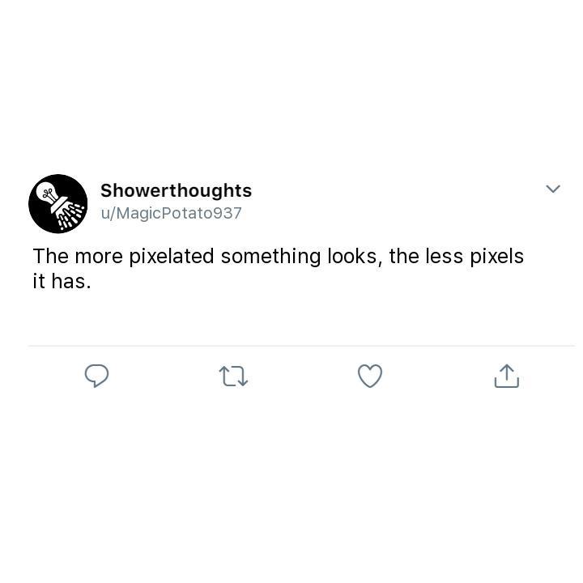

# Reddposter
Bot that grabs content from Reddit (r/showerthoughts), repackages it from a tweet template, and reposts it on Instagram every interval.

 

> "Talk about cross-platform!"

**Unknown**

 

## Installation / Configuration
- `git clone https://github.com/willuhm-js/Reddposter`
- `cd Reddposter`
- Edit the configuration in `src/config.js`
- `node src/index.js`

 

## License
**Reddposter** is licensed under the [MIT License](https://github.com/willuhm-js/Reddposter/blob/master/LICENSE)

 

## Gallery

